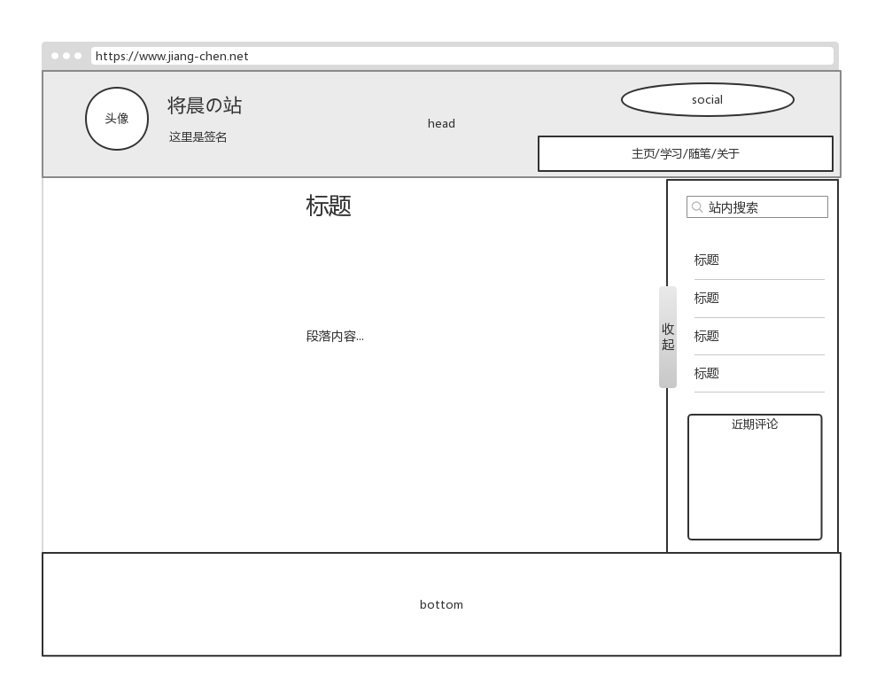
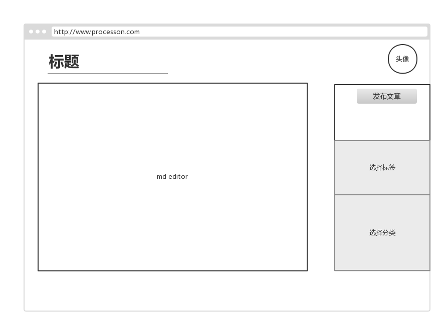

# 开发日志

2018/11/4

初步架构

dataHelper: Hibernate对数据库所作的操作

Controller:处理前端http请求

Repository：数据库操作接口

Repositorympl:数据库操作接口的实现

Model:模板类

Service：Controller对后端相关操作的调用接口

ServiceImpl

技术栈：

Vue

Spring Boot

Maven

Hibernate

本日工作：

搭建后端框架：

spring boot + hibernate

解决mysql驱动找不到的问题：maven引入符合本机mysql版本的版本

hibernate配置

- 配置hibernate.cfg.xml文件
- 配置dataHelper，实现Hibernate下的数据的增删改查。

2018/11/5

需求列表

| 功能需求                | 实现思路                   |
| ------------------- | ---------------------- |
| 登陆登出&增加用户           | root用户可以添加用户，没有用户注册的渠道 |
| 在线编辑和发表博客           | 编辑博客采用MD开源编辑器内核        |
| 获取网站访问量和文章访问量       | 访问量可以通过统计访问IP来解决？      |
| 发表和回复评论             |                        |
| 侧边功能栏               | 写成vue component        |
| 实现上传图片的渠道，可以更改头像、背景 | 裁剪图片的轮子（可以考虑自己造一个）     |
|                     |                        |

原型图

前端md文件的编辑、保存、读取

编辑：考虑Vue-markdown或EditorMD开源插件

保存：把md文本保存到服务器data/username/blog底下

读取：考虑showdown开源插件

本日工作：

- 实现前后端通信。使用技术：axios

- 学会使用postman测试后端
- login组件绘制完成

明日工作：

- 前后端传文件
- md文件读取
- 目的文件编辑

编辑文章界面原型图

2018/11/6

本日工作：

- md展示和编辑（使用插件mavon-editor)
- md文章编写界面的绘制

明日工作：

后端

- File存储和读取，img文件的保存和读取

- 建article数据表（必要数据：id、title、tags、categories、date、author）

  ​

